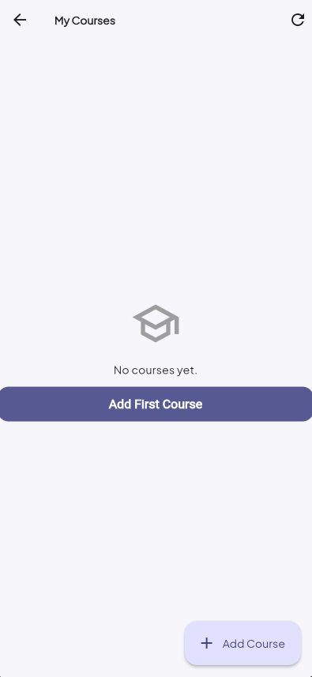
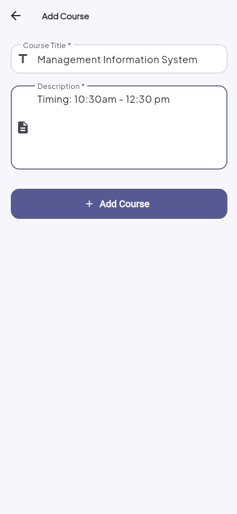
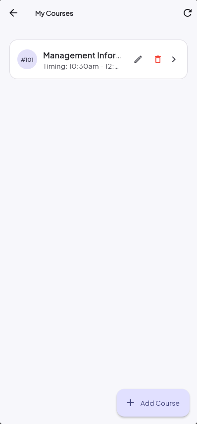

# Student Auth App – Course API Integration

This is an extension of my Flutter authentication app. In this part, I integrated the JSONPlaceholder REST API to add full CRUD functionality for managing courses.

---

## Branch

**`feature/course-api-integration`**

---

## Student Info:

Name: Muhammad Ahsan
Roll No: SE-221099
Class: SE-8B

## API Used

**JSONPlaceholder** – https://jsonplaceholder.typicode.com

I used JSONPlaceholder because it's a free, ready-to-use fake API that lets you practice real HTTP requests without needing a backend. It supports GET, POST, PUT, and DELETE out of the box which made it perfect for this assignment.

### Documentation I followed

https://jsonplaceholder.typicode.com/guide

I went through the guide to understand how each endpoint behaves before writing any code, especially to understand that POST always returns id 101 and that data isn't actually saved server-side.

### Endpoints used

| What it does     | Method | Endpoint      |
| ---------------- | ------ | ------------- |
| Load all courses | GET    | `/posts`      |
| Load one course  | GET    | `/posts/{id}` |
| Add a course     | POST   | `/posts`      |
| Update a course  | PUT    | `/posts/{id}` |
| Delete a course  | DELETE | `/posts/{id}` |

---

## What I built

### Authentication (from previous submission)

- Login and register screens
- Email and password validation
- Remember Me using shared preferences
- Dashboard screen after login

### Course CRUD (added in this branch)

- **Read** – the course list loads automatically when you open the screen. There's a loading spinner while it fetches and an error message with a retry button if something goes wrong.
- **Create** – tapping Add Course opens a form. On submit it sends a POST request and the new course shows up at the top of the list.
- **Update** – tapping Edit on any course opens the same form but with the existing data already filled in. On save it sends a PUT request and updates the list.
- **Delete** – each course has a delete button. A confirmation dialog appears before anything is removed, and the item disappears from the list after a successful DELETE request.

### How I structured the code

I kept the API logic completely separate from the UI. All HTTP calls go through `CourseApiService` and the state (loading, success, error) is managed in `CourseProvider` using the Provider package. The screens just listen to the provider and react accordingly.

---

## Folder structure

```
lib/
├── controllers/
│   └── auth_controller.dart
├── models/
│   ├── course_model.dart         ← added
│   ├── subject.dart
│   └── user.dart
├── providers/
│   └── course_provider.dart      ← added
├── screens/
│   ├── course_list_screen.dart   ← added
│   ├── course_form_screen.dart   ← added
│   ├── course_detail_screen.dart ← added
│   ├── dashboard/
│   ├── detail/
│   ├── login/
│   └── register/
├── services/
│   └── course_api_service.dart   ← added
├── theme/
├── validators/
├── widgets/
│   ├── course_card.dart          ← added
│   ├── custom_button.dart
│   └── custom_text_field.dart
└── main.dart
```

---

## Packages added to pubspec.yaml

```yaml
http: ^1.2.1
provider: ^6.1.2
```

---

## Screenshots

### Course List

All courses fetched from the API displayed as a scrollable list.



---

### Adding a New Course

The form screen for creating a course with title and description fields.


---

### After Course is Created

The new course appears at the top of the list after the POST request succeeds.



---

### Course Detail

Tapping a course row opens the detail screen showing the full title and description.



---

## How to run

```bash
git clone <your-repo-url>
cd student_auth_app
git checkout feature/course-api-integration
flutter pub get
flutter run
```

---

## A few things worth noting

Since JSONPlaceholder is a fake API, nothing is actually saved on the server. Every POST returns id 101 and refreshing the page reloads the original dummy data. This is expected — the point was to practice making real HTTP requests and handling the responses correctly, which the app does.
