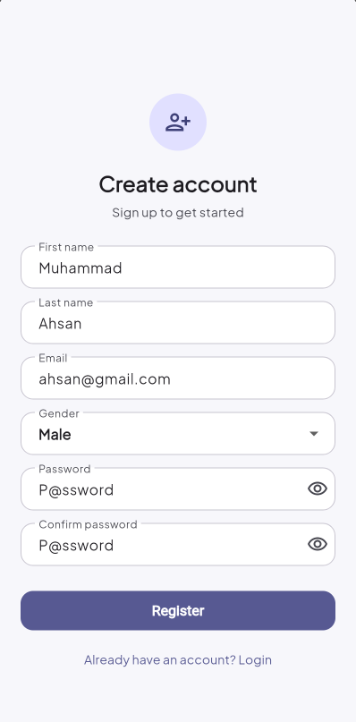
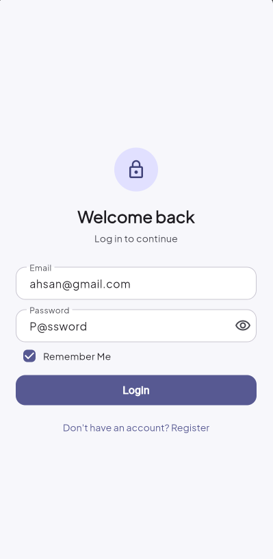
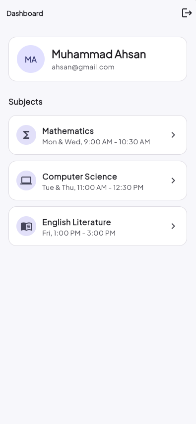
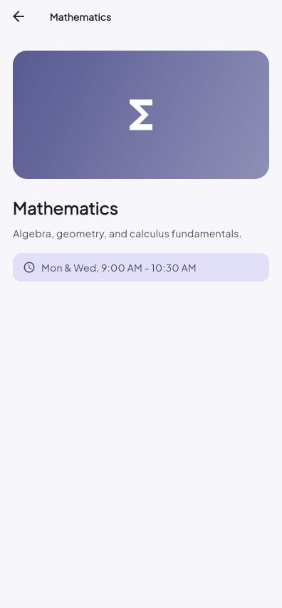

# Student Authentication & Dashboard App

<!-- Replace the title above with whatever your assignment brief calls it -->

**Student Name:** Muhammad Ahsan
**Student ID:** SE-221099 SE-8B

## Description

A Flutter app demonstrating user registration, login, and navigation between
screens, with form validation and a "Remember Me" session that persists
across app restarts via SharedPreferences.

## Features

- Register screen with live field validation (name, email format, password
  strength, confirm-password match) and a submit button that's disabled
  until the form is valid.
- Login screen with email/password validation, a password visibility
  toggle, and a Remember Me checkbox.
- Dashboard screen showing the logged-in user's name, email, and avatar
  initials, plus a list of subjects.
- Detail screen showing static info for a tapped subject.
- Logout that clears the remembered session and returns to Login.

## Setup

```
flutter pub get
flutter run
```

## Screenshots

| Register                                     | Login                                  |
| -------------------------------------------- | -------------------------------------- |
|  |  |

| Dashboard                                      | Detail                                   |
| ---------------------------------------------- | ---------------------------------------- |
|  |  |

## Project Structure

```
lib/
├── main.dart
├── theme/           AppTheme — colors, typography, input/button/card styling
├── models/          User, Subject
├── enums/           Gender, AuthState
├── validators/      Validators (pure Dart)
├── controllers/     AuthController (in-memory session + SharedPreferences)
├── widgets/         CustomTextField, CustomButton
└── screens/
    ├── register/
    ├── login/
    ├── dashboard/
    └── detail/
```
